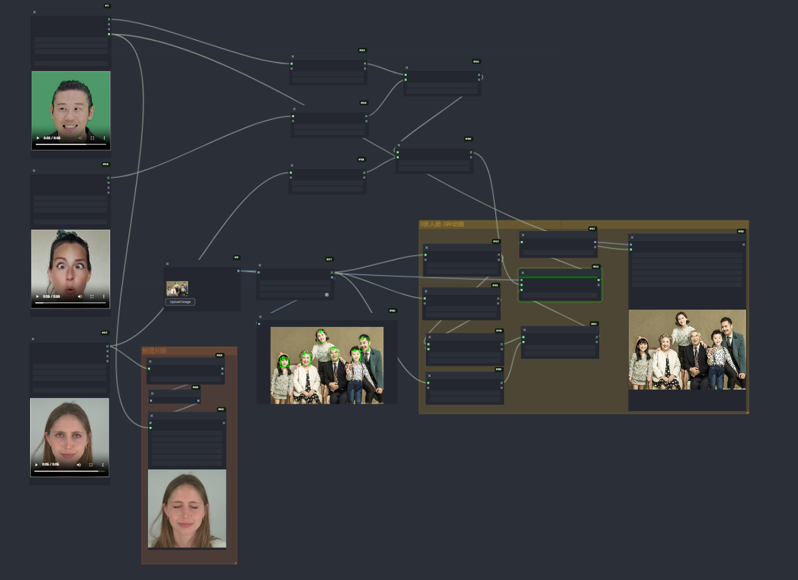
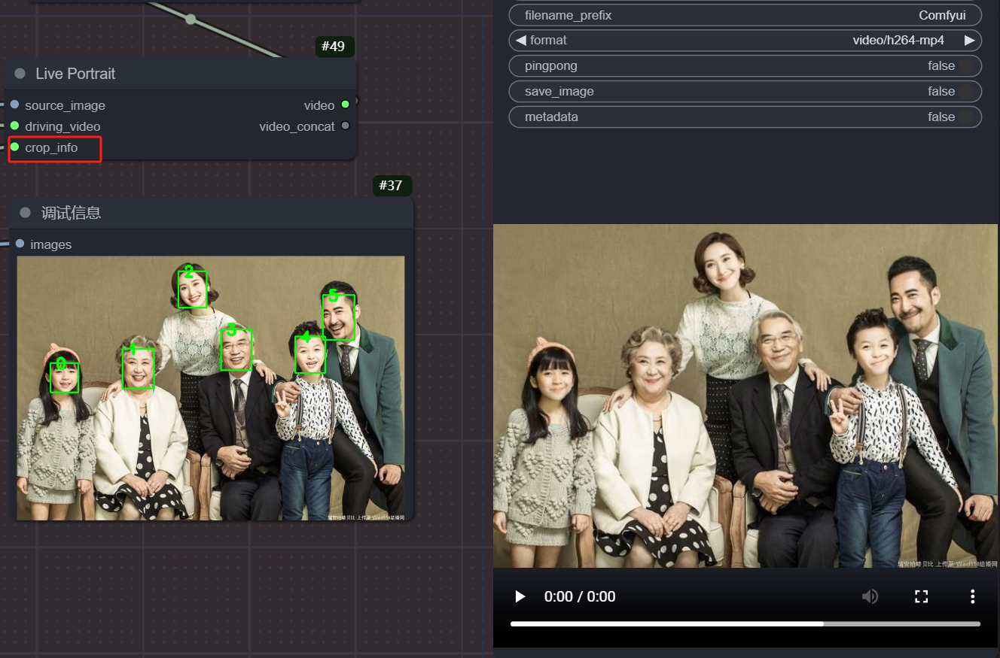
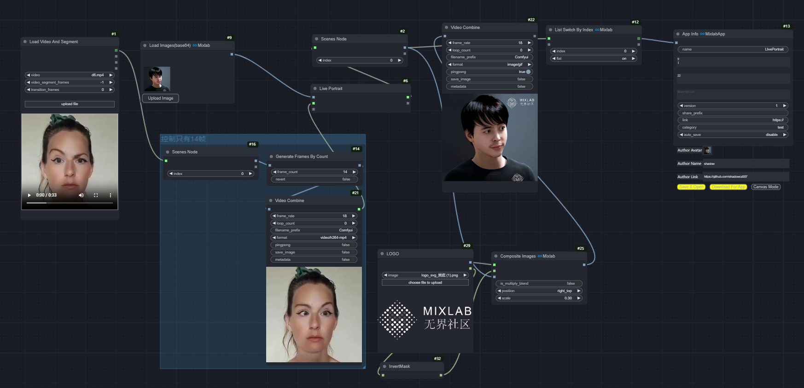

[LivePortrait](https://github.com/KwaiVGI/LivePortrait)的Comfyui版本。

!! 支持多人脸 、不同的脸 指定不同的动画

> [寻求帮助 Mixlab nodes discord](https://discord.gg/cXs9vZSqeK)

> [推荐：mixlab-nodes](https://github.com/shadowcz007/comfyui-mixlab-nodes)


### workflow
> 配合 [comfyui-mixlab-nodes](https://github.com/shadowcz007/comfyui-mixlab-nodes) 使用

> 全家福

[](example/mul-workflow.json)
[不同脸对应不同的驱动视频 Workflow JSON](example/mul-workflow.json)


[](example/全家福模式-workflow.json)

[全家福 Workflow JSON](example/全家福模式-workflow.json)


[](example/live_workflow.json)

[Workflow JSON](example/live_workflow.json)

[AppInfo workflow JSON](example/appinfo-workflow.json)

### Nodes

##### Live Portrait，用于生成动态肖像。

输入参数：
source_image：输入一张静态图像，作为生成动态肖像的基础。
driving_video：输入一个驱动视频，决定动态肖像的动作和表情变化。
crop_info：输入人脸裁剪信息，用于指定人脸的裁剪区域。

输出：
video：输出生成的动态肖像视频。
video_concat：输出与驱动视频合成后的动态肖像视频（如果有的话）。


##### Face Crop Info，用于提取图像中的人脸裁剪信息。

可调参数：
face_sorting_direction：设置人脸排序方向，可选值为 "left-right"（从左到右）或 "large-small"（从大到小）。用于在图像中包含多张人脸时，确定哪张人脸优先处理。

face_index：指定要处理的人脸索引，默认值为 -1，表示处理所有检测到的人脸。可以设置为特定的索引值以选择特定的人脸。

debug：开启或关闭调试模式。设置为 true 时，会输出调试图像以便查看人脸检测和裁剪区域；设置为 false 时，不输出调试图像。

##### Retargeting 可开关eye lip是否驱动


### models

[google drive](https://drive.google.com/drive/folders/1UtKgzKjFAOmZkhNK-OYT0caJ_w2XAnib)

[百度](https://pan.baidu.com/s/1WpZ1FrqYLLytvLBIpTWShw?pwd=MAI0)

放置到 

``` Comfyui/models/liveportrait ``` 

``` Comfyui/models/insightface ```

### python环境依赖

[打包好的环境](https://pan.baidu.com/s/1oQCvtWR2seFloZDGsNGNTQ?pwd=MAI0)

如果安装了 [comfyui-mixlab-nodes](https://github.com/shadowcz007/comfyui-mixlab-nodes) ，是不需要再安装新的依赖的。


#### 相关插件推荐

[Comfyui-ChatTTS](https://github.com/shadowcz007/Comfyui-ChatTTS)

[comfyui-sound-lab](https://github.com/shadowcz007/comfyui-sound-lab)

[comfyui-Image-reward](https://github.com/shadowcz007/comfyui-Image-reward)

[comfyui-ultralytics-yolo](https://github.com/shadowcz007/comfyui-ultralytics-yolo)

[comfyui-moondream](https://github.com/shadowcz007/comfyui-moondream)

